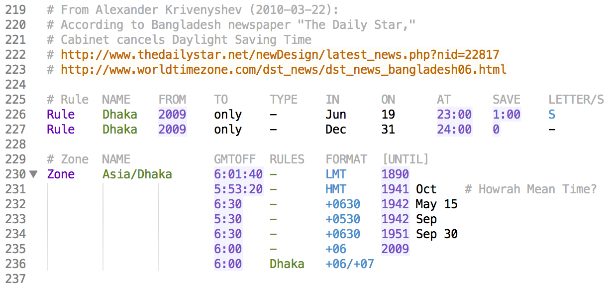

# Sublime zoneinfo

A [Sublime Text](http://www.sublimetext.com/) package that adds syntax highlighting for [IANA time zone database](http://iana.org/time-zones) files (a.k.a. zoneinfo files).

Syntax highlighting is provided for the raw time zone definition files:

- africa
- antarctica
- asia
- australasia
- backward
- backzone
- etcetera
- europe
- factory
- northamerica
- pacificnew
- southamerica
- systemv

As well as associated metadata files:

- iso3166.tab
- leap-seconds.list
- leapseconds
- zone.tab
- zone1970.tab

### Example screenshot

## Installation

Find it as **[zoneinfo](https://packagecontrol.io/packages/zoneinfo)** through [Package Control](https://packagecontrol.io/).

---

If you really want, you can use the old-school manual installation method (but using Package Control is easier):

Find your package installation path with Sublime Text by selecting Preferences -> Browse Packages...

Then open that directory in a terminal and run `git clone https://github.com/gilmoreorless/sublime-zoneinfo.git`

## Development

All highlighting rules are defined in `zoneinfo.YAML-tmLanguage` using [YAML](http://en.wikipedia.org/wiki/YAML) syntax. The `zoneinfo.tmLanguage` file is auto-generated from the YAML using [AAAPackageDev](https://github.com/SublimeText/AAAPackageDev).
